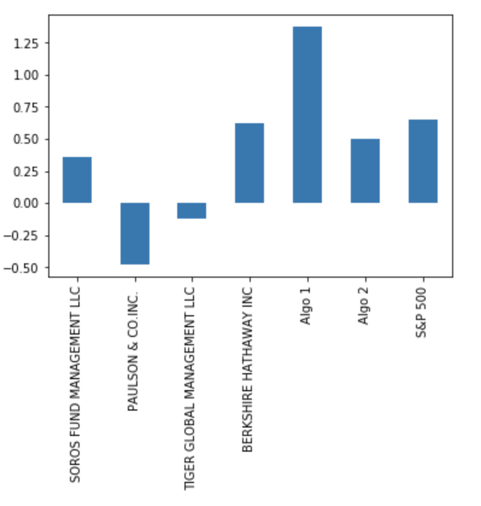
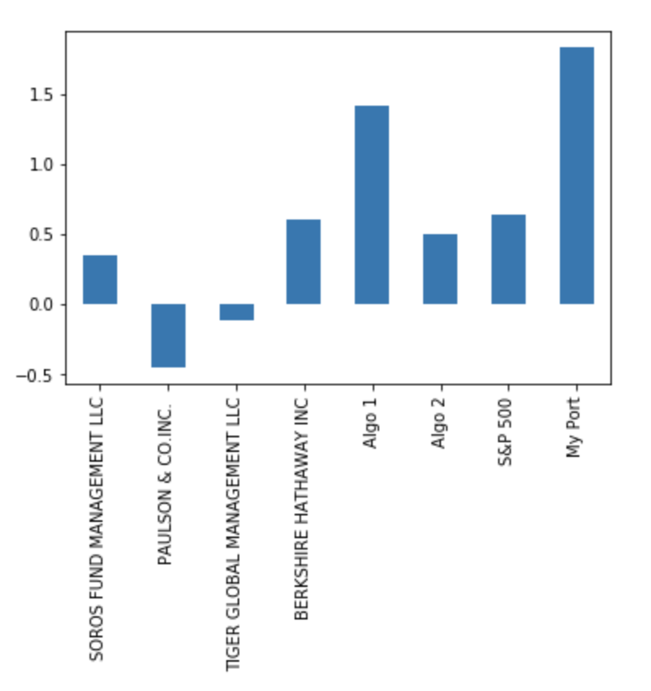

# A Whale Off the Port(folio)

## Background

The investment division of Harold's company has been investing in algorithmic trading strategies. Some of the investment managers love them, some hate them, but they all think their way is best. Therefore, We will use quantitative analysis techniques with Python and Pandas to determine which portfolio is performing the best across many areas: volatility, returns, risk, and Sharpe ratios.

In this code, We created a tool (an analysis notebook) that analyzes and visualizes the major metrics of the portfolios across all of these areas, and determine which portfolio outperformed the others. We used the historical daily returns of several portfolios: some from the firm's algorithmic portfolios, some that represent the portfolios of famous "whale" investors like Warren Buffett, and some from the big hedge and mutual funds. We used this analysis to create a custom portfolio of stocks and compare its performance to that of the other portfolios, as well as the larger market (S&P 500).

In this assignment, we will be accomplishing three main tasks:

1. Read in and Wrangle Returns Data
2. Determine Success of Each Portfolio
3. Choose and Evaluate a Custom Portfolio

### 1. Prepare the Data

First, we read and clean several CSV files for analysis. The CSV files include whale portfolio returns, algorithmic trading portfolio returns, and S&P 500 historical prices. 

1. We Use Pandas to read in each of the CSV files as a DataFrame and convert the dates to a `DateTimeIndex`.

2. We detect and remove null values.

3. We remove dollar signs from the numeric values and convert the data types as needed.

4. Since the whale portfolios and algorithmic portfolio CSV files contain daily returns, but the S&P 500 CSV file contains closing prices, we convert the S&P 500 closing prices to daily returns.

5. We Joined `Whale Returns`, `Algorithmic Returns`, and the `S&P 500 Returns` into a single DataFrame with columns for each portfolio's returns.

  

### 2. Conduct Quantitative Analysis

We analyzed the data to see if any of the portfolios outperform the stock market (i.e., the S&P 500).

#### Performance Analysis

1. After we calculated cumulative returns, we found that Algo 1 and BERKSHIRE HATHAWAY INC outperforms the S&P 500
 
#### Risk Analysis

1. After we created a box plot for each of the returns, we found that Tiger Global Management LLC has the largest spread, whereas Paulson & CO.INC has the smallest spread.

 

2. After we Calculated the standard deviation for each portfolio, we found that BERKSHIRE HATHAWAY INC and TIGER GLOBAL MANAGEMENT LLC are riskier than S&P 500 because they have higher STDs than S&P 500

 

#### Rolling Statistics

1. After Plotting the rolling standard deviation of the firm's portfolios along with the rolling standard deviation of the S&P 500 we can see that SOROS and Algo 2 are most closely correlated with the S&P.

2. When we Constructed a correlation table for the algorithmic, whale, and S&P 500 returns, we found that Algo2 is most closely mimicing the S&P as it has the highest correlation value, then Soros Fund Management. 

3. After plotting a rolling beta between BERKSHIRE HATHAWAY INC portfolio returns and S&P 500 returns, we can see that the portfolio seem sensitive to movements in the S&P , because the beta plot has a positive trend (mostly greater than 1).

### Plot Sharpe Ratios

Investment managers and their institutional investors look at the return-to-risk ratio, not just the returns. (After all, if you have two portfolios that each offer a 10% return, yet one is lower risk, you would invest in the lower-risk portfolio, right?)

- Using the daily returns, We calculated and visualized the Sharpe ratios using a bar plot.

### Create Custom Portfolio

- We decided to create our own portfolio that performs just as well or even better than the algorithmic portfolios. To do this, we have done the following:

1. Visited [Google Sheets](https://docs.google.com/spreadsheets/) and use the in-built Google Finance function to choose 3-5 stocks for your own portfolio.

2. We chose NVIDIA, MSCI, and Amazon.

3. We download the data as CSV files and calculate the portfolio returns.

4. We added our portfolio returns to the DataFrame with the other portfolios and rerun the analysis.

 
 
 
 
 

### Analysis
- My portfolio outperforms others as indicated by the cumulative return and the sharpe ratios.
- Algo 2 and Soros are the most correlated with the market. Whereas Algo 1 is the least correlated.
- My portfolio is ranked the fourth correlated portfolio with the market.
- My portfolio consists of three stocks:
   - NVIDIA: is the least correlated with the S&P500 and the most with my portfolio
   - MSCI: is the most correlated with S&P500 and the least with my portfolio
   - Amazon: is the median correlated stock with both my portfolio and S&P500
 - The combination of the three stocks (NVIDIA, MSCI, Amazon) makes my portfolio the best performing portfolio among the other given portfolios.

